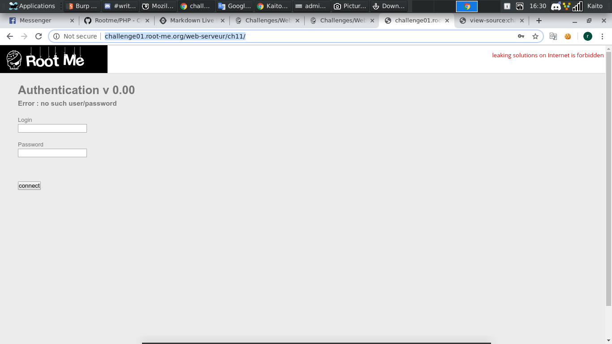
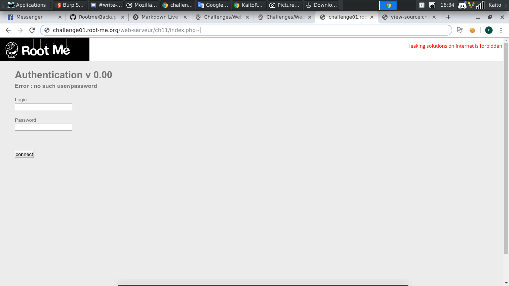
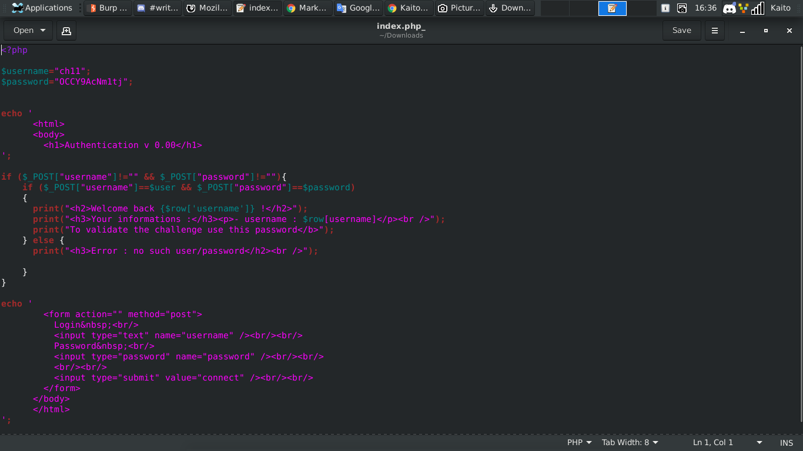

# Backup file

[Link](http://challenge01.root-me.org/web-serveur/ch11/)

- Mới vào thì cũng chả biết làm gì. Cố login vô cũng không được

- Đành đi đọc tài liệu mà rootme cho

- Thêm vào url cũ `http://challenge01.root-me.org/web-serveur/ch11/` thành `http://challenge01.root-me.org/web-serveur/ch11/index.php~`

- Thêm dấu `~` vào url để tải file backup về

- Thật sự chả biết nói gì về kỹ thuật này, có lẽ bây giờ chả có ai lưu backup kiểu đó. Tuy nhiên vẫn coi như có kinh nghiệm để đời, biết đâu 1 ngày nào đó gặp lại bài CTF theo kiểu này thì sao

- Gác lại mấy chuyện khác, mở file `index.php_` xem có gì

- Thôi rồi, password này chính là flag chứ đâu nữa
