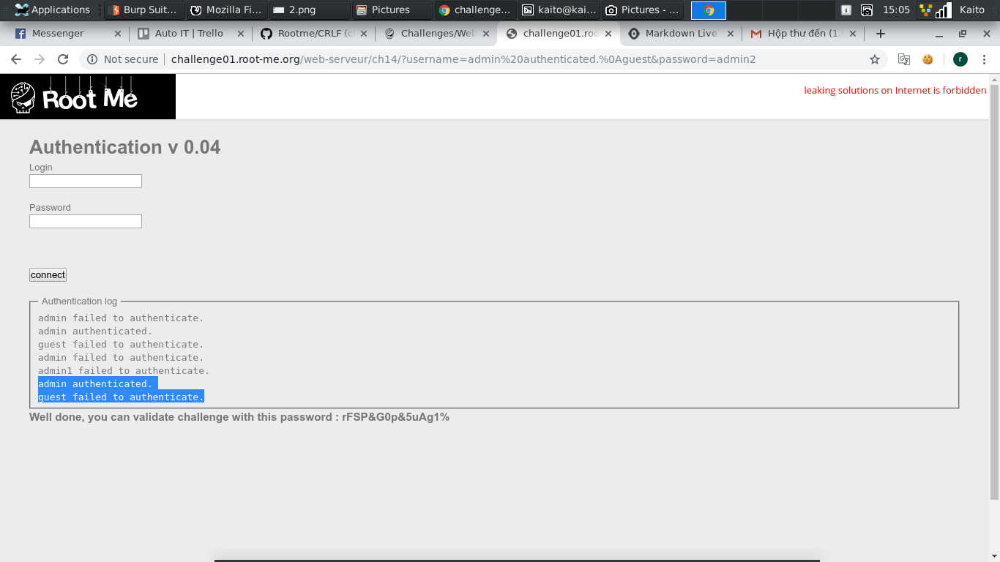

# CRLF

[Link](http://challenge01.root-me.org/web-serveur/ch14/)


- Mở đầu trang web là 1 **form login** và 1 **Authentication log**

- Thử cố login nhưng có vẻ khá vô vọng

- Đề bài là `CRLF`, thôi thì cố bypass theo kiểu đề cho thôi...

- Để ý thì mỗi lần login thì **username** sẽ được lưu vào **Authentication log** dưới dạng:

```
username failed to authenticate.
```

- Giả sử với **username** là *admin*:

```
admin failed to authenticate.
```


- Theo suy luận đơn giản, chỉ cần **Authentication log** xuất hiện theo dạng:

```
admin authenticated.
guest failed to authenticate.
```

- Thì sẽ được xác nhận là *admin*

- Bây giờ chỉ cần nhập **username** thành dạng như trên và khi lưu vào log được thì sẽ ra flag

- payload:

```username: admin authenticated.%0Aguest
```


- Phần `failed to authenticate.` sẽ được tự động thêm vô. Kết quả ta đã có được đoạn log như ý muốn

- `%0A` được biểu như dấu xuống dòng



