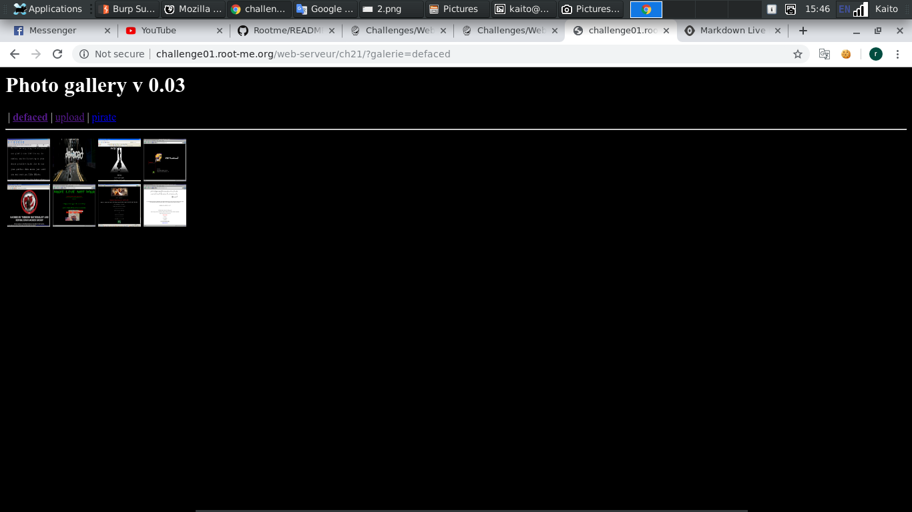
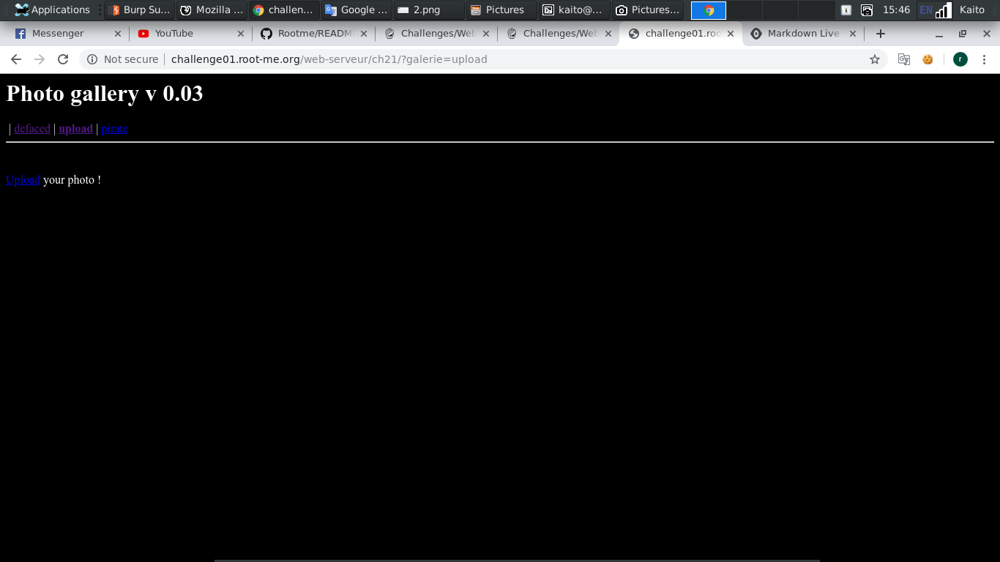
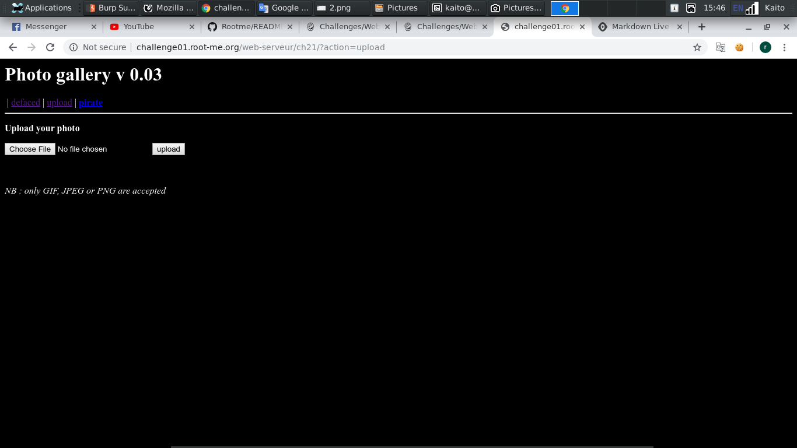
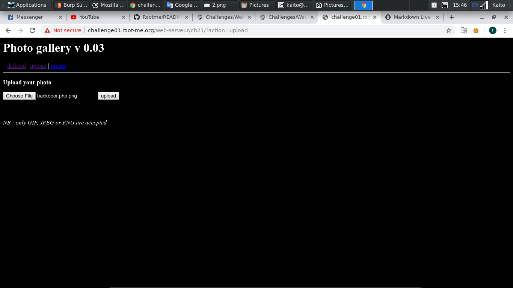
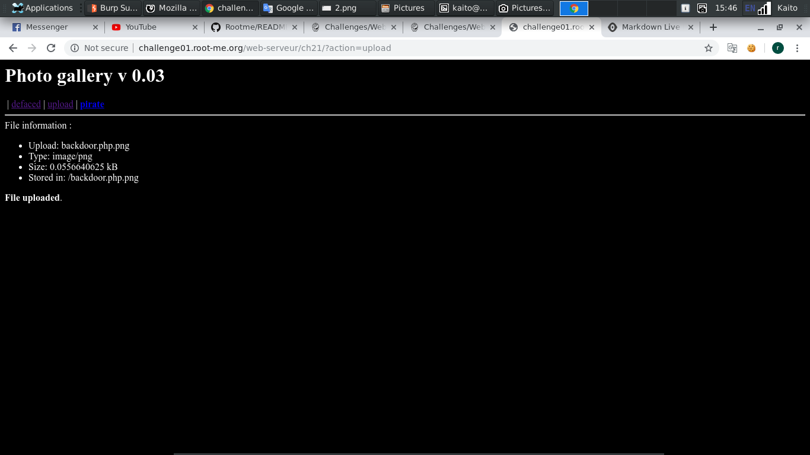
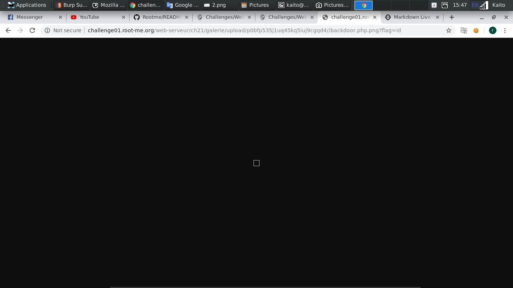
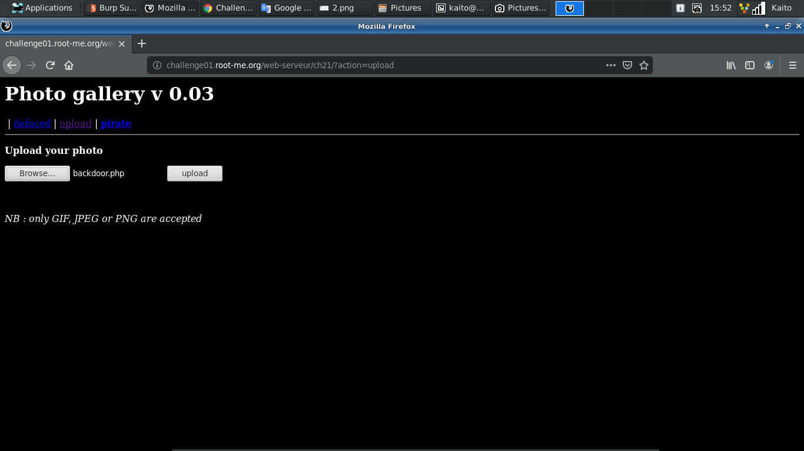
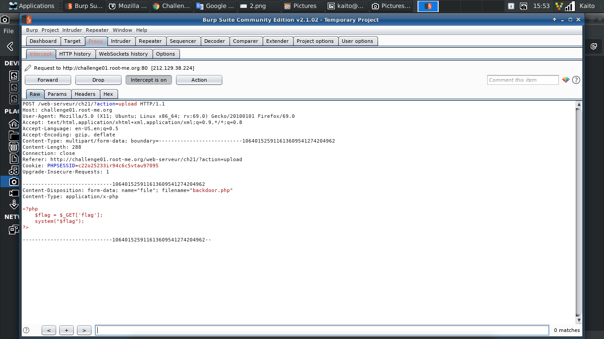
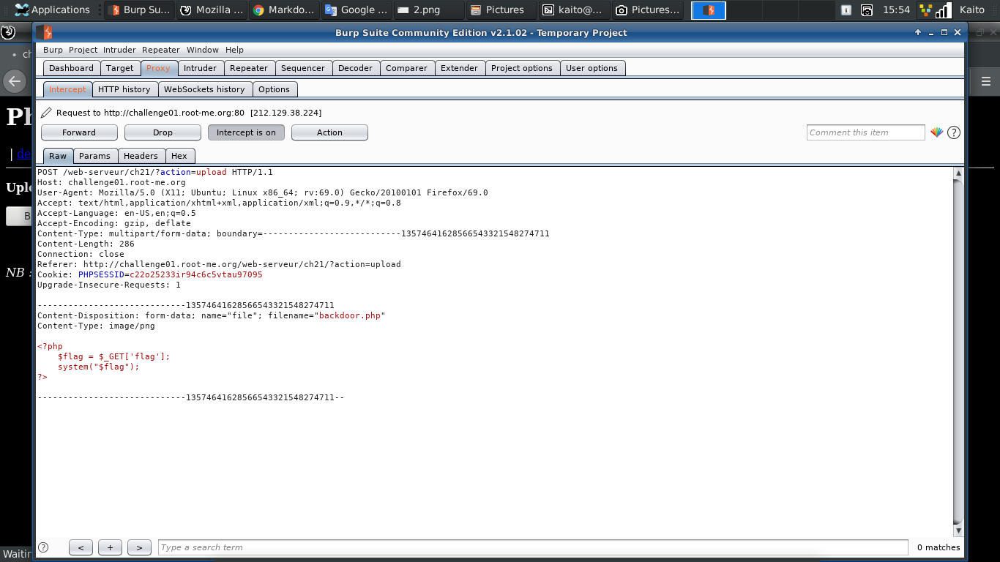
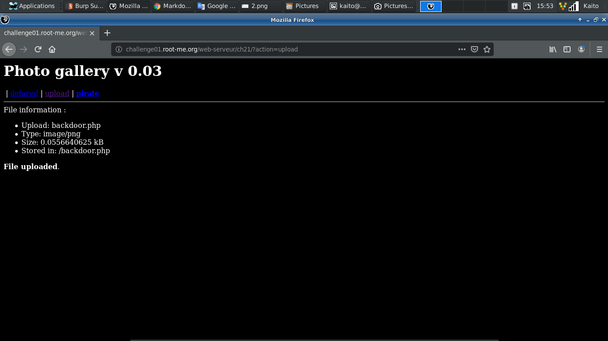

# File upload - MIME type

[Link](http://challenge01.root-me.org/web-serveur/ch21/)

- Trang web tựa như bài `File upload - Double extensions`, upload cũng như vậy. Nhưng có vẻ kỹ thuật này bị fail rồi, ta không thể **injection** vào server thông qua file vừa up













- Có vẻ như bài này nhận diện file thông qua client, thử dùng `Burp suite` để chặn lại rồi đôi **type** xem sao



- Sửa `Content-Type: application/x-php` thành `Content-Type: image/png`





- OK, thành công như ý muốn



- Các bước còn lại làm như bài `File upload - Double extensions`

- Payload:

```
cat ../../../.passwd
```


