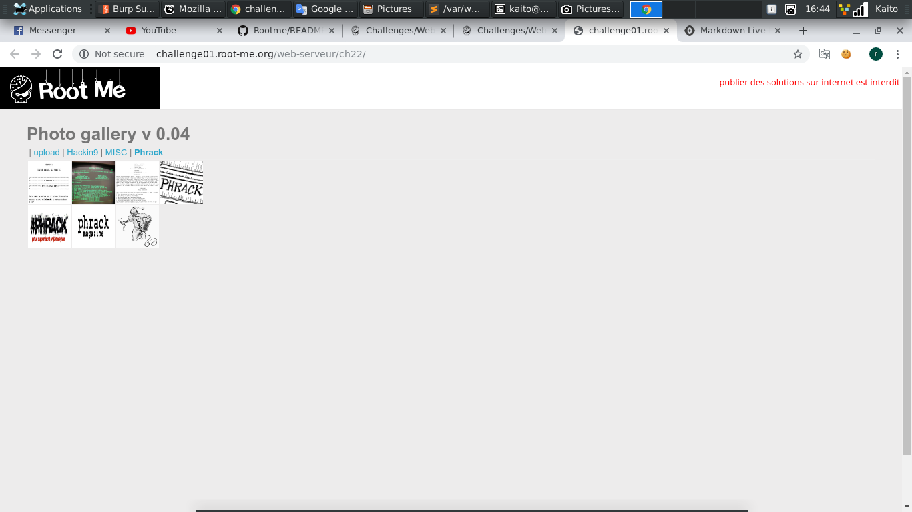

# File upload - Null byte

[Link](http://challenge01.root-me.org/web-serveur/ch22/)

- Cũng cùng là 1 dạng giống như 2 bài `File upload` trước đó, chỉ là đổi kỹ thuật tấn công thôi

- Đề cho là `Null byte` thì upload file `backdoor.php%00.jpeg`. Khi upload lên thì server sẽ tự động bỏ phần sau `%00` đi, vậy là ta có được file `backdoor.php` hoàn chỉnh

- Vì bài 1 cũng đưa link rồi, và kỹ thuật `Null byte` thôi cũng không nói nhiều nữa

- Perfect, upload file thành công và có flag luôn

