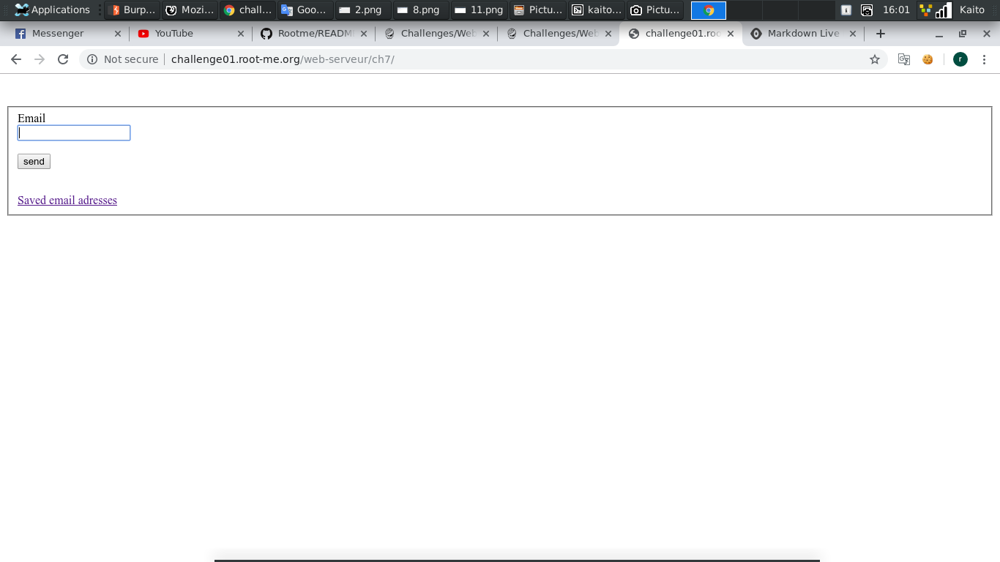
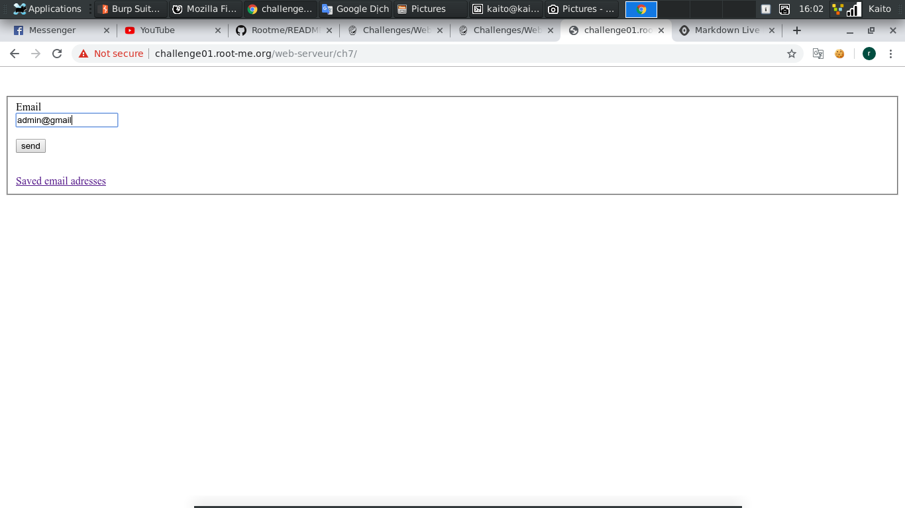
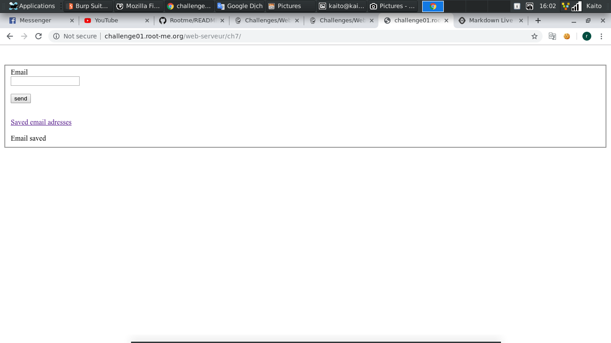
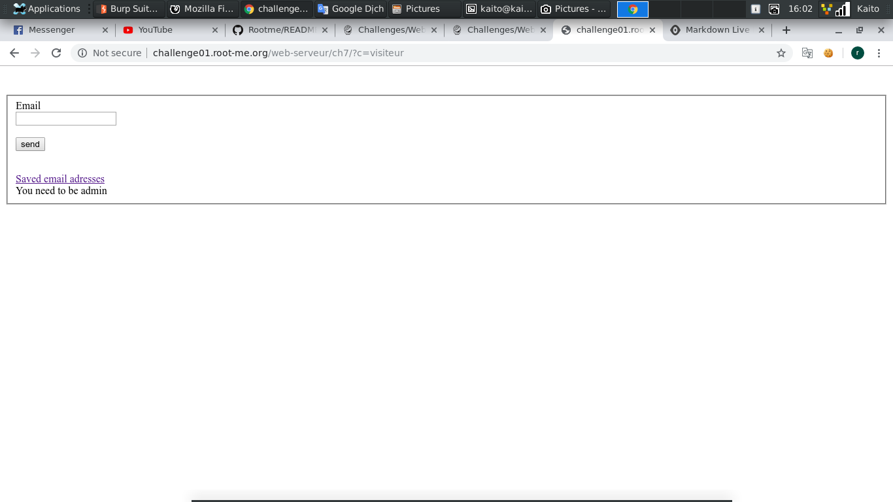
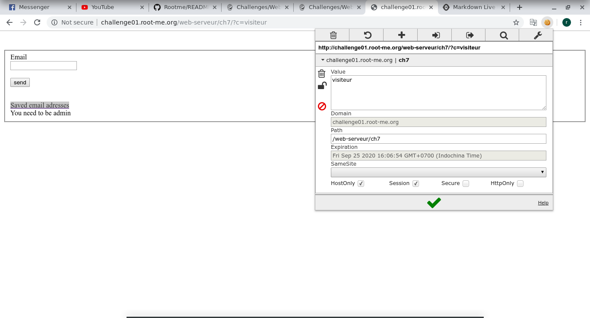
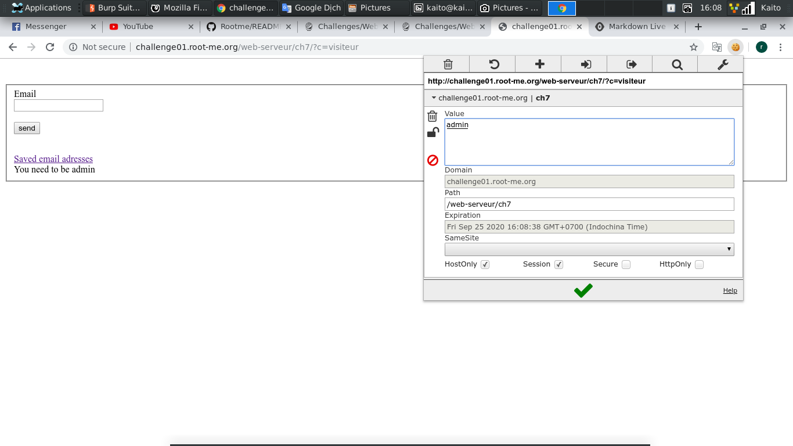
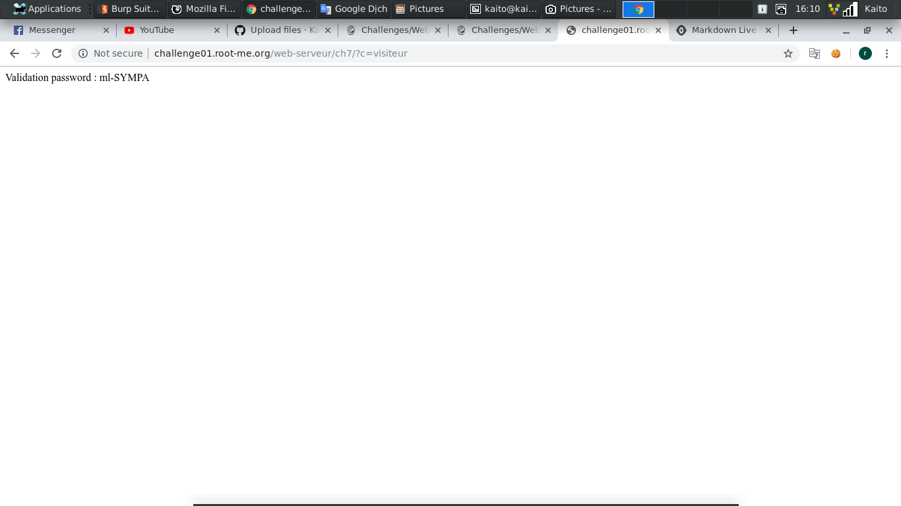

# HTTP - Cookies

[Link](http://challenge01.root-me.org/web-serveur/ch7/)

- Mở đầu trang là 1 `form email`, thử nhập email và submit xem nào

- OK, hoạt động bình thường và chả có gì xảy ra cả

- Thử click vào link `Saved email adresses` xem, sao

- Nó đòi hỏi phải có quyền admin. Mà hint đề cho là `cookie` nên vào trình **edit cookie** xem thế nào

- Có thể thấy rõ cookie có 1 đoạn: `ch7=visiteur`, vậy thì ta đổi lại thành `admin` thôi và load lại trang xem thế nào

- Kết quả mỹ mãn, flag hiện ra

 
