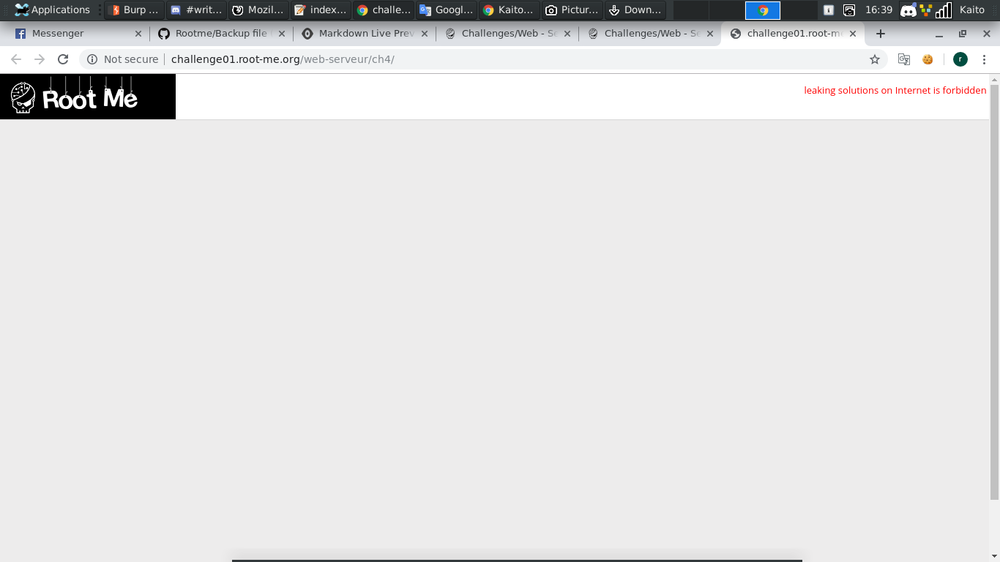
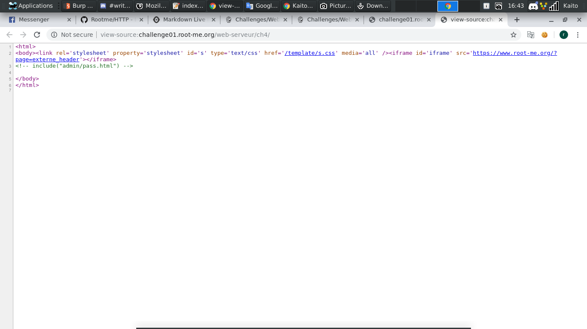
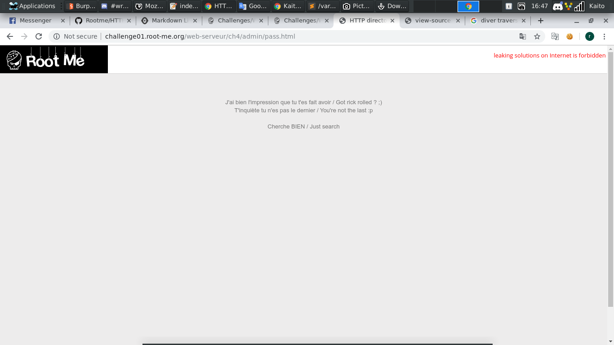
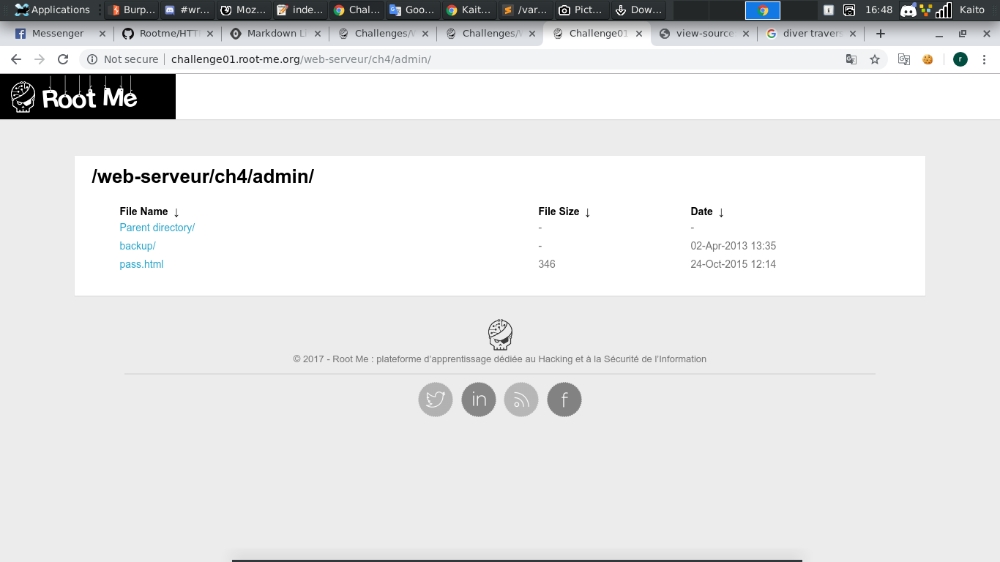
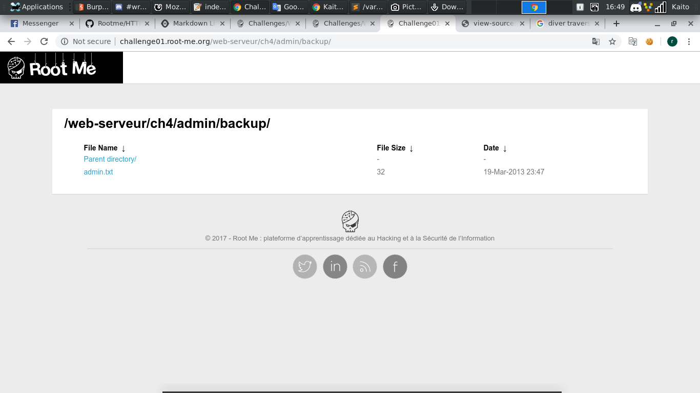
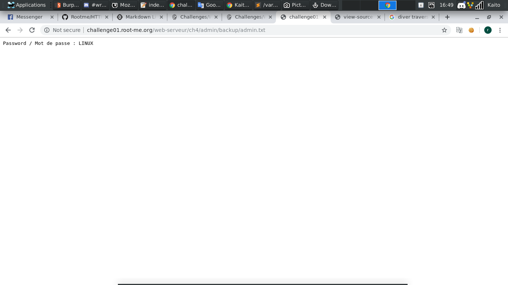

# HTTP - Directory indexing

[Link](http://challenge01.root-me.org/web-serveur/ch4/)

- Vừa vào thì chả có gì ở trang web cả, thôi thì `Ctrl + U` Thử xem có gì nào

- 1 đoạn `include("admin/pass.html")` hiện ngay trước mặt. Cộng thêm tên đề bài `Directory indexing`. Chắc kèo dính lỗi `directory traversal` rồi. Google để biết hơn về lỗi này

- Do dev không chặn truy cập folder trái phép từ bên ngoài nên bây giờ ta vô file mà bài `include` vô xem có gì nào

- Nhìn không thấy flag đâu, đọc đoạn tin thì có vẻ đây là troll

- thôi thì vô hẳn folder `admin` xem có gì nào

- Nãy vô `pass.html` rồi, giờ vô thử folder `backup` xem sao

- Thấy file `admin.txt`, mở luôn thử

- Flag đây, rồi
