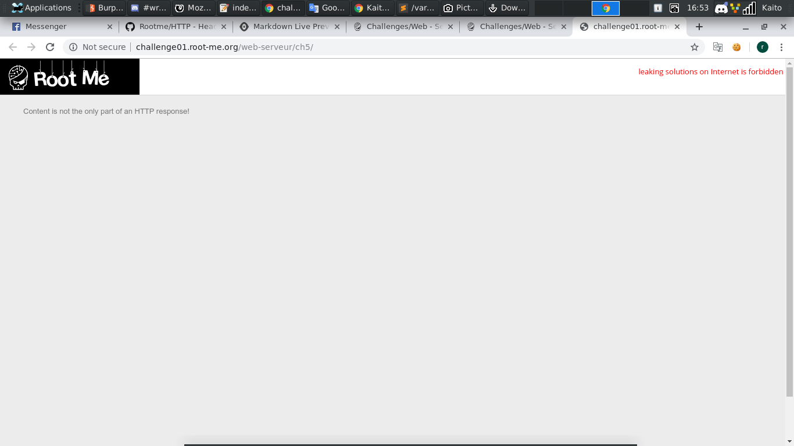
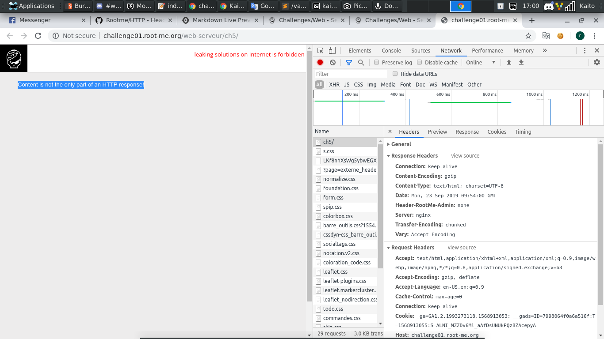
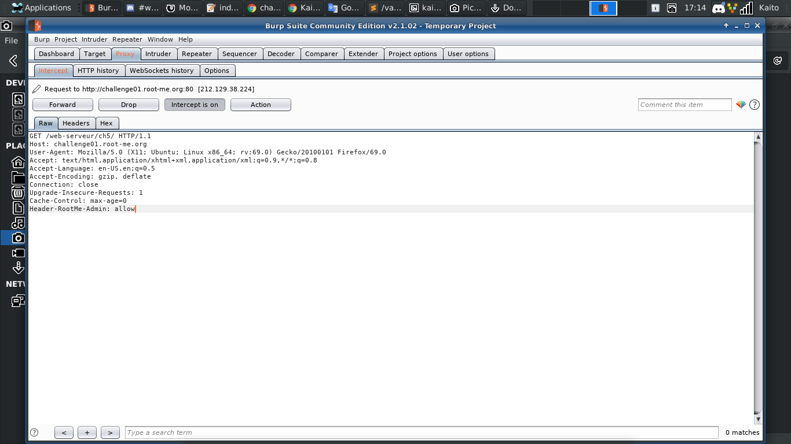
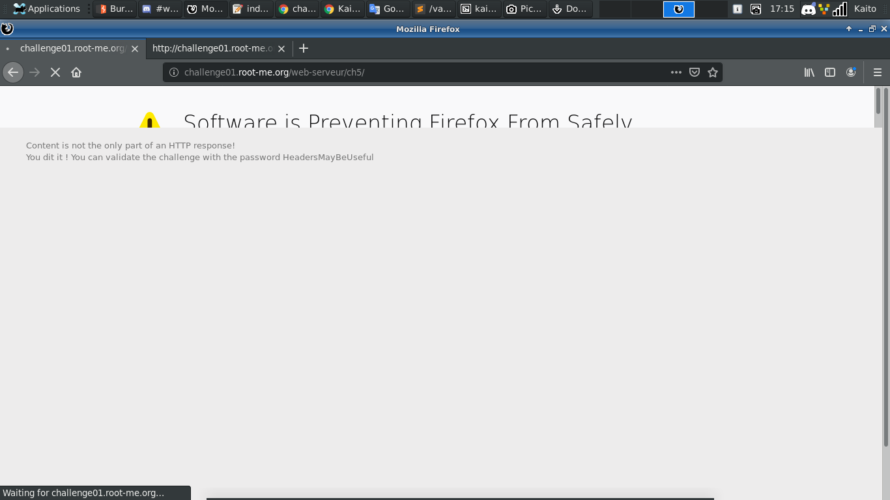

# HTTP - Headers

[Link](http://challenge01.root-me.org/web-serveur/ch5/)



- Mở đầu trang web là đoạn thông báo này:

```
Content is not the only part of an HTTP response!
```

- Thấy có `HTTP response` trong đoạn thông báo. `F12` luôn và ngay để xem trong `HTTP response` có gì đặc biệt



- Để ý kỹ thì đoạn `Header-RootMe-Admin: none` này không có trong format chung của `HTTP response`. Chắc kèo là do người ra đề thêm vào

- Nhưng mà bên `HTTP requests` lại không có đoạn này, thử vô `burp suite` tự thêm vô và sửa `none` thành `allow` xem sao



- Ra flag luôn


