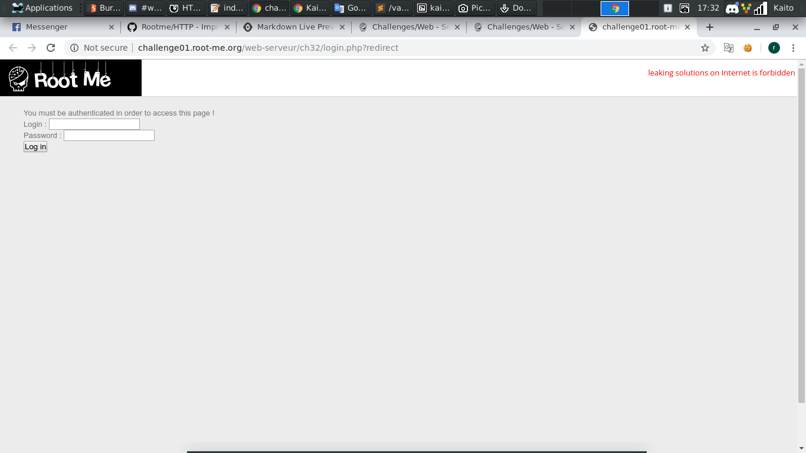
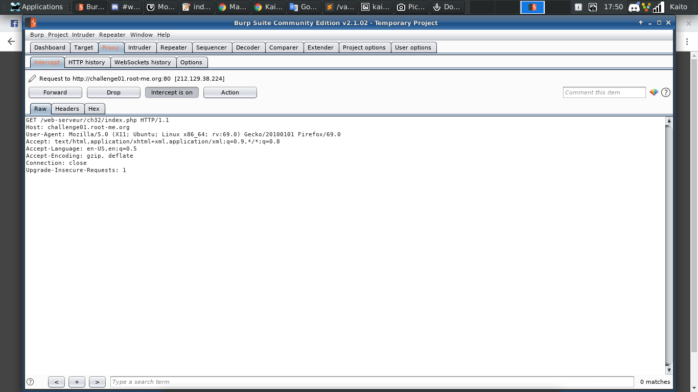
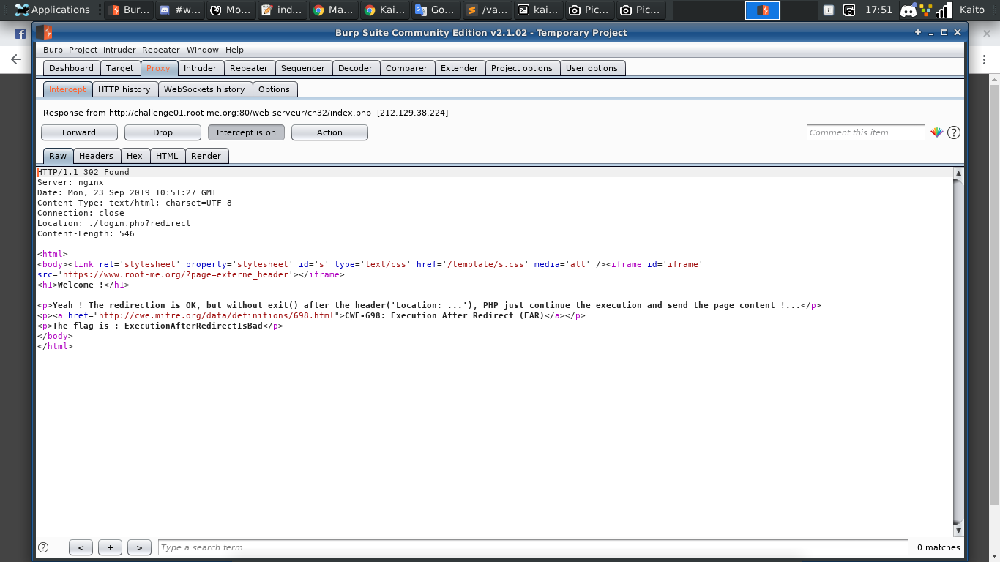

# HTTP - Improper redirect

[Link](http://challenge01.root-me.org/web-serveur/ch32/)

- Vừa vào chưa kịp làm gì mà đã bị chuyển hướng sang trang `login.php`

- Thử cố login nhưng không thành. Đổi link thành `index.php` để vô trang chủ nhưng vẫn bị chuyển hướng sang trang login, hm hm...

- Nếu để ý 1 chút thì khi ta load trang với đuôi `index.php` thì có vẻ nó có load trang `index.php` 1 chút rồi mới chuyển thẳng qua trang login

- Giờ thì dễ rồi, qua `Burp suite` chặn cả response là xem được thôi mà :v

- Chuột phải > Do intercept > response to this requests

- Flag đây rồi

