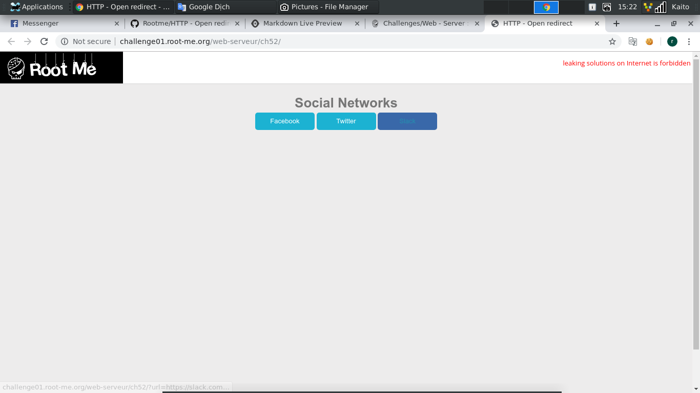
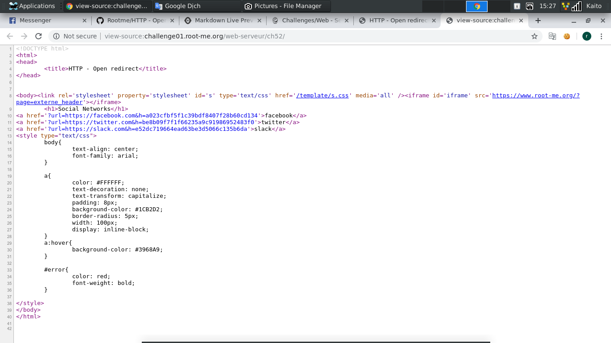
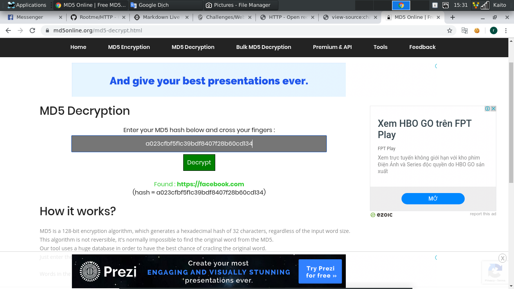
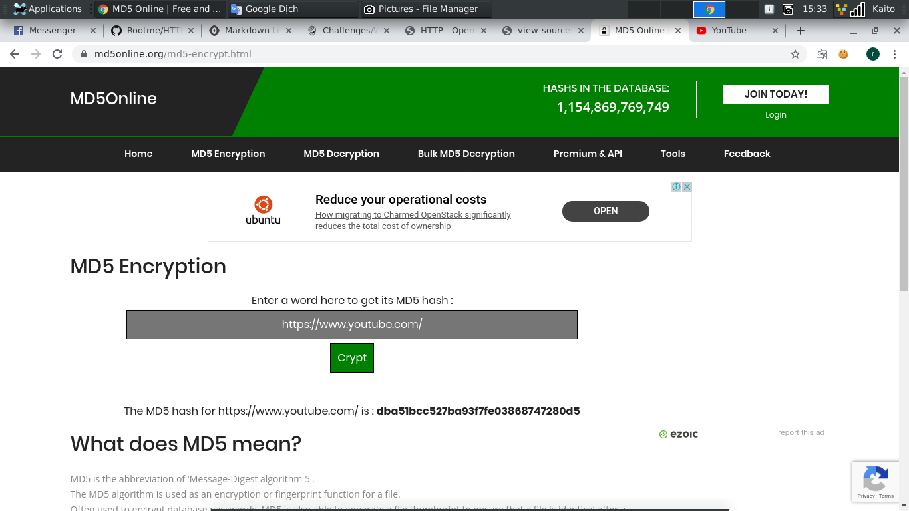

# HTTP - Open redirect

- Mở đầu trang web là 3 button `fb`, `tw`, `slack`, Click vô `fb` thử thì đi đến trang `fb.com`, khá dễ hiểu



- Để ý hint:
```
Find a way to make a redirection to a domain other than those showed on the web page.
```

- Vấn đề ở đây là người ra đề muốn click vào link `fb` nhưng lại đi tới trang khác chữ không phải là `fb.com`

- `Ctrl + U` thử xem có gì không



- Có vẻ bài này liên qua đến link, phân tích thử cái link:
```
https://facebook.com&h=a023cfbf5f1c39bdf8407f28b60cd134
```

- Đoạn `https://facebook.com` thì không có gì để bàn rồi. Quan trọng là đoạn `h=a023cfbf5f1c39bdf8407f28b60cd134`, nhìn có vẻ giống với mã `md5`, với thêm chữ `h` làm query chính nữa thì chắc kèo đây là mã `md5 hash` của `https://facebook.com`

- Thử `decode` đoạn mã `md5 hash` trên xem có phải là `https://facebook.com` không



- Đúng như dự đoán, bây giờ thì dễ rồi, chỉ cần đỗi mã `hash md5` thành link tới trang khác là xong. Ở đây mình lấy link `https://www.youtube.com/`



- Giờ thì đổi lại url và chạy thử thôi. Vấn đề bây giờ là không chỉnh bằng cách bình thường được, thôi thì qua `Burp suite` để sửa cho lẹ


