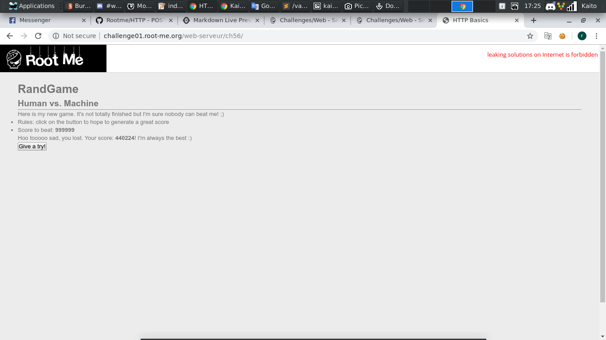
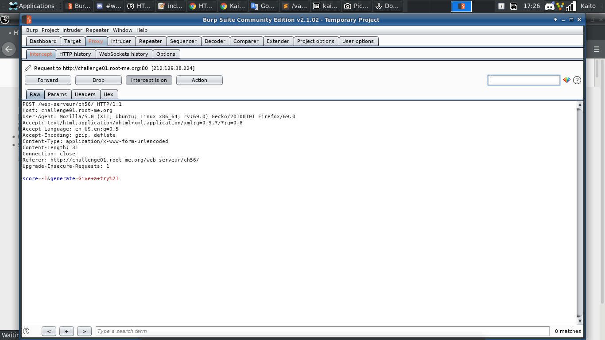
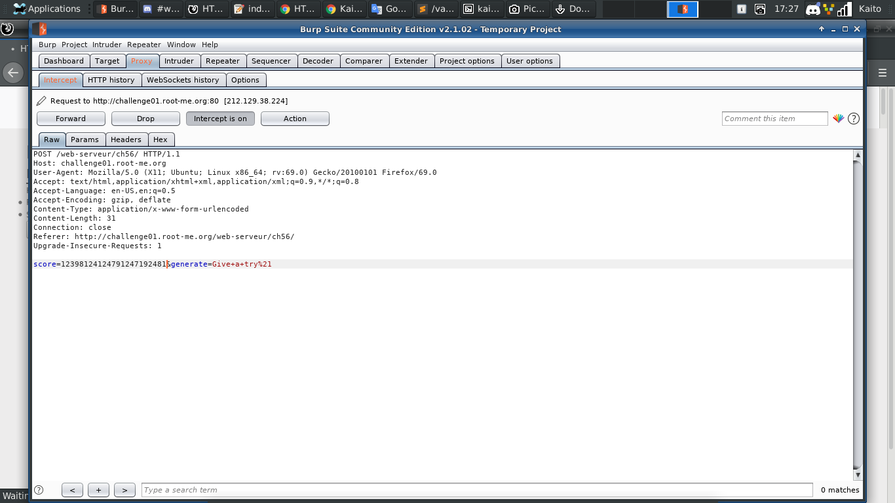
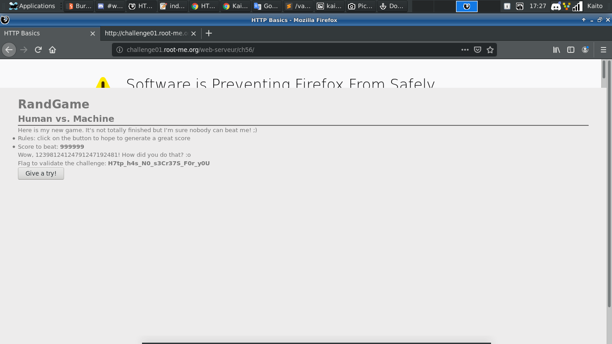

# HTTP - POST

[Link](http://challenge01.root-me.org/web-serveur/ch56/)

- Ở đây có 1 trò chơi, nếu bạn submit điểm cao hơn của trang web thì thắng

- Thử submit vài lần xem sao

- Như dự đoán, không được là chuyện đương nhiên

- Ở đây có vẻ điểm được tạo từ phía client rồi gửi lên server. Bây giờ qua `Burp suite` để chơi lại xem sao

- Bây giờ chỉnh sửa biến `score` lên cao hơn đề cho xem nào. Tạm thời chưa cần quan tâm tới hàm tạo điểm cho lắm, vì nó không ảnh hưởng nhiều lắm

- Flag hiện ra luôn, vậy thì ta có thể lờ đi đoạn `javascript` tạo điểm từ biến `score` cho đỡ mệt

