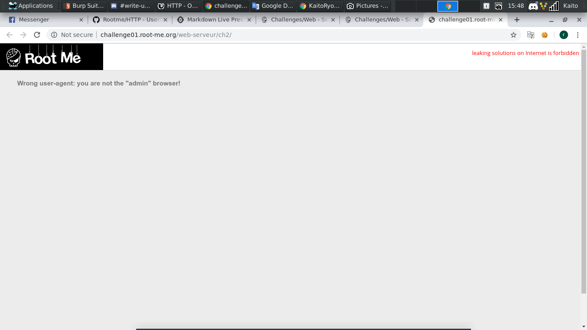
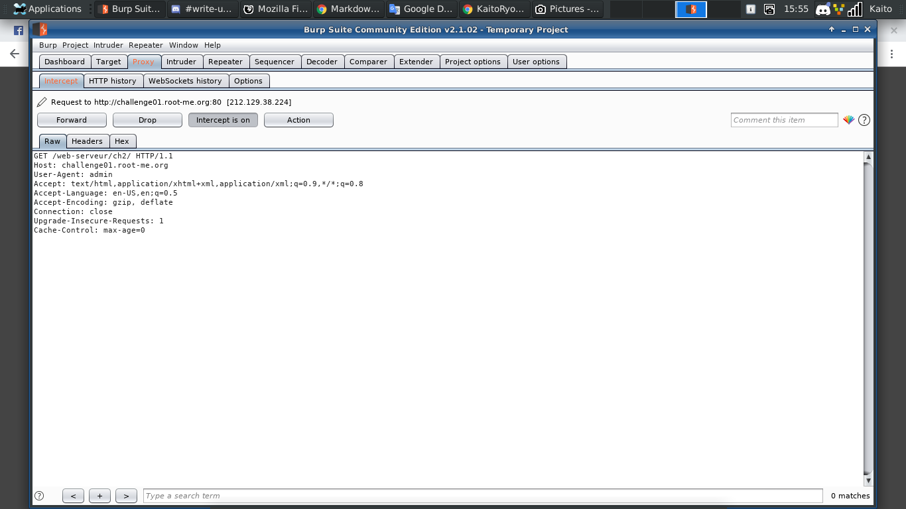
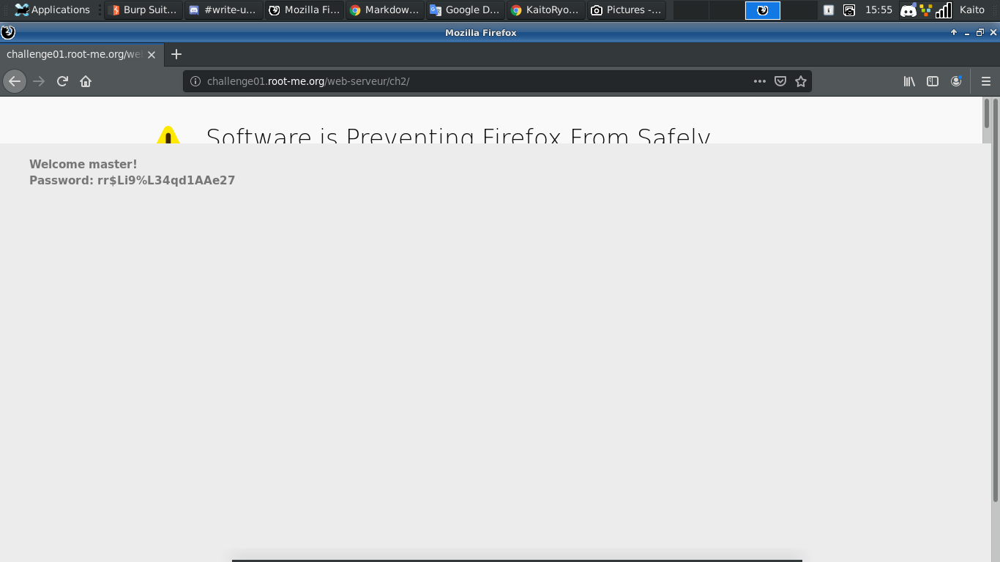

# HTTP - User-agent 

[Link](http://challenge01.root-me.org/web-serveur/ch2/)

- Bổ trợ kiến thức về `Requests Header` trước khi đọc bài này

- Vừa vào trang web thì có đúng 1 dòng thông báo: 
```
Wrong user-agent: you are not the "admin" browser!
```



- Nhìn qua thì có vẻ liên quan tới `Requests Header`

- Thử vào `Burp suite` sửa đoạn `User-Agent` với value là `admin` xem sao



- Không bất ngờ lắm, flag hiện ra luôn


