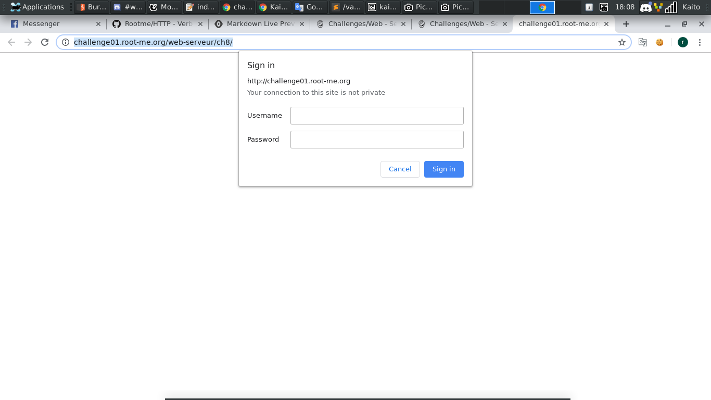

# HTTP - Verb tampering

[Link](http://challenge01.root-me.org/web-serveur/ch8/)

- Đọc thêm vềg lỗi `Verb tampering` [Link](https://resources.infosecinstitute.com/http-verb-tempering-bypassing-web-authentication-and-authorization/#gref)

- Đọc thêm 1 chút về CURL [Link](https://curl.haxx.se/docs/manual.html)

- Phải nói thì đây là kỹ thuật vi diệu để vượt qua xác thực của trang web. Thường là xác thực với `javascript`



- Mở đầu trang web là xác thực tài khoản

- Cố login vào nhưng không được. Để ý laị tên đề `Verb tampering`. Đúng chất cái tên nói lên tất cả. Thử vào curl load trang với `mothod` khác xem

- Sau 1 vài lần thử thì cũng có kết quả

- Payload: 

```
curl -X OPTIONS http://challenge01.root-me.org/web-serveur/ch8/
```

- `CURL -X OPTIONS` ở đây với `-X OPTIONS` là loại method


