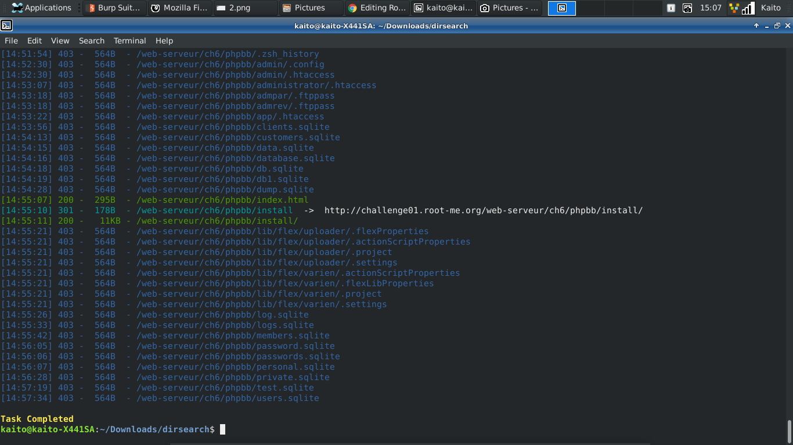

# Install files

[Link](http://challenge01.root-me.org/web-serveur/ch6/)

- Nhìn sơ qua thì có vẻ trang web chả có gì, thử `Ctrl + U` xem có gì

- Ở đây có 1 đường dẫn, thử vô xem

- Vô xong trang cũng trắng nốt, `Ctrl + U` cũng không thấy gì

- Cứ như 1 vòng lặp, thử vài cái như `phpBB` các kiểu mà hint cho cũng vô dụng...

- Suy nghĩ 1 hồi nhưng vẫn khá vô vọng, cho thử vô tool `dirsearch` xem có quét được gì không

- Quét được đuôi `/install`, vào thử xem có gì thì thấy có 1 file `install.php`, vô xem thì flag xuất hiện

