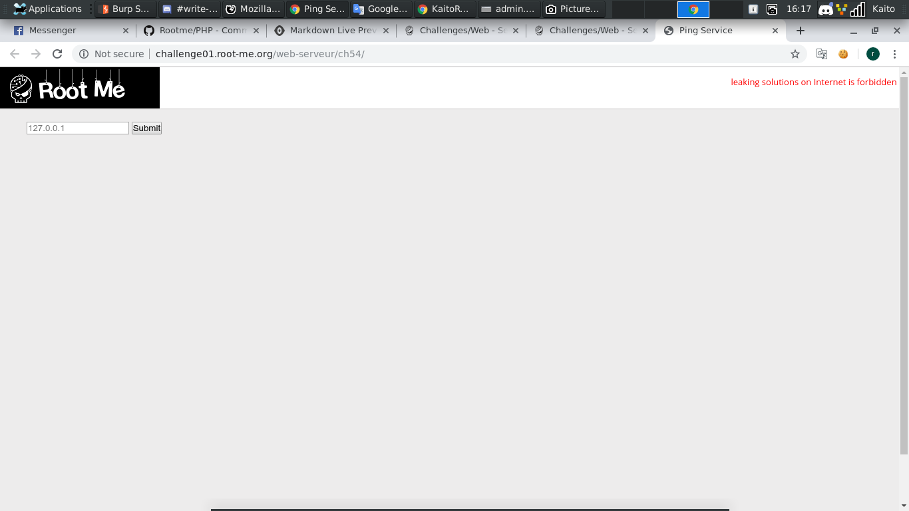
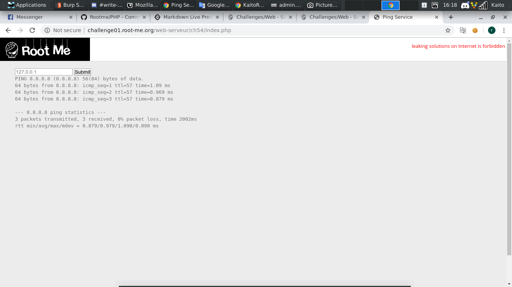
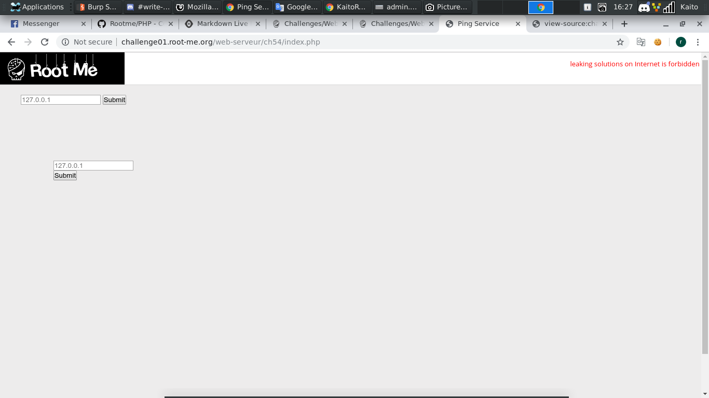
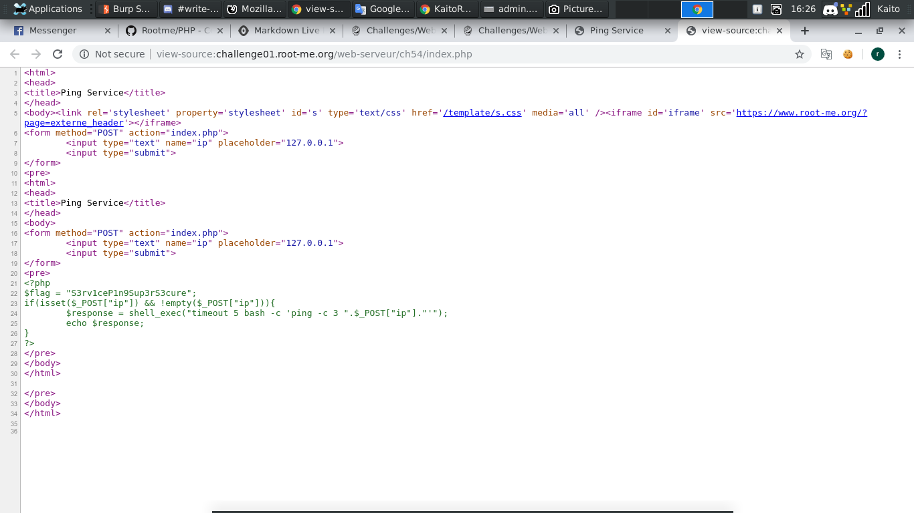

# PHP - Command injection

[Link](http://challenge01.root-me.org/web-serveur/ch54/)



- Đây là 1 web để ping thử server, thử ping `8.8.8.8` xem thế nào



- Ok, hoạt động tốt. `Command injection` chỉ đơn giản là chèn thêm payload để chạy trên `ternimal` thôi

- Kèm theo ký tự `|`, `||`, `&`, `&&`, `;`, `$()`, ... Để được chạy thêm đoạn payload khác

- Ở đây bài chỉ kiểm tra đoạn `8.8.8.8` thôi nên ta thêm đằng sau sẽ không bị chặn lại

- Đọc lại hint 1 chút:

```
The flag is on the index.php file.
```

- Rõ ràng rồi, flag nằm trong file index.php, bây  giờ chỉ cần `cat` file index.php là được

- Sau khi thử 1 vài payload thì đây là payload có thể hoạt động được:

```
8.8.8.8 | cat index.php
```



- `Ctrl + U` xem trong file `index.php` xem có gì nào


